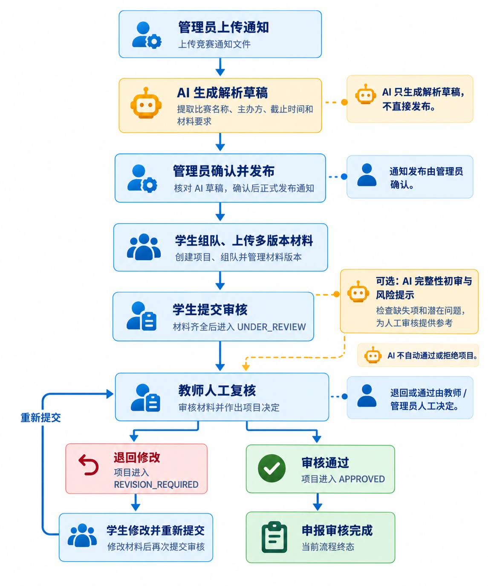
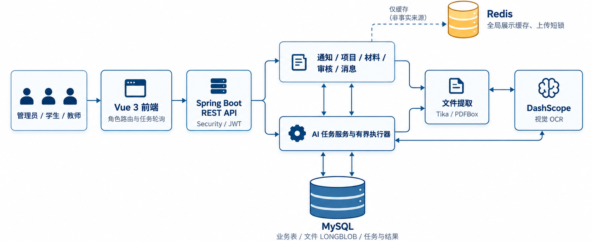

# AI 材料申报与审核平台

面向高校竞赛申报的 Spring Boot + Vue 系统：把通知解析、材料提交、AI 初审和人工复核串成可追踪的业务流程。

管理员上传竞赛通知并核对 AI 解析草稿后发布；学生按材料清单组队申报、上传多版本文件；教师查看授权项目并复核材料。AI 提供辅助意见，不自动发布通知或替代人工审核。

## 业务流程

AI 只生成解析草稿和初审意见；通知发布、材料退回与审核通过均由人工决定。



## 技术与架构

| 层 | 当前实现 |
| --- | --- |
| 前端 | Vue 3、Vite、Element Plus、Axios；按角色路由与任务轮询 |
| 后端 | Java 21、Spring Boot 3.5、Spring Security/JWT、MyBatis-Plus、Flyway |
| 数据与缓存 | MySQL 8 保存业务数据、文件 LONGBLOB、AI 任务与结果；Redis 用于全局展示数据缓存和上传短锁，故障时回退数据库 |
| 文档与 AI | Tika 提取文本，PDFBox 渲染扫描页，DashScope `qwen3.7-flash` 做视觉 OCR、通知结构化解析与材料初审 |



单体应用通过 REST API 服务 Vue 前端。通知、项目、材料、审核与通知消息由 Spring Boot 管理；外部 AI 调用在数据库事务外执行。[三张工程图](docs/portfolio/engineering-diagrams.md)给出了系统、异步任务及 PDF 处理的节点关系。

## 核心工程实现

- **异步 AI 任务**：通知解析与材料检查先在 MySQL 写入 `PENDING`，返回 `taskId`，再由共享的有界线程池执行。worker 条件更新领取任务；定时扫描恢复遗留 `PENDING`，超时和晚到结果受任务行、deadline 与输入快照约束。前端按任务 ID 查询状态；`MODEL`、`FALLBACK` 和无结果故障分开记录。核心实现见 [`NoticeAiTaskDispatcher`](backend/src/main/java/com/eliza/aicompetition/service/NoticeAiTaskDispatcher.java) 与 [`AgentTaskRecoveryScheduler`](backend/src/main/java/com/eliza/aicompetition/service/AgentTaskRecoveryScheduler.java)。
- **人工确认与数据一致性**：通知 AI 结果先写解析草稿，管理员确认后才进入正式通知和材料要求；材料 AI 结果按当时的要求与文件版本快照留痕，教师审核独立记录。数据库唯一约束和短事务守住并发结果，Redis 不承担 AI 任务正确性。
- **扫描 PDF 与长文档**：Tika 优先处理文本型 PDF；无有效文本才走 PDFBox 分页渲染和视觉 OCR。扫描路径限制 20 MiB、20 页、每批 2 页及最多 2 个并发视觉请求，单页有限重试；缺页标 `OCR_PARTIAL` 并提示人工核对，超预算明确要求提供文本或人工核对。通知正文按页和换行分段，最多 8 段、每段 4000 字符，模型结果再确定性合并。处理链路见[工程图](docs/portfolio/engineering-diagrams.md)。
- **可解释的 AI Eval**：三份带文件 SHA-256 和原文证据的 gold 样本，经确定性规则评分字段、材料 precision/recall 和必交标记；`FALLBACK` 不进入模型质量分母。同一 10 页扫描样本从前 3 页基线改为 10/10 页 OCR 后，材料 TP/FP/FN 从 `0/2/3` 到 `3/1/0`（precision `0.75`、recall `1.00`）。这是参与过 Prompt 调整的**已知样本单次组件级回归**，不能代表未知通知的泛化准确率或生产 SLA。评测口径与复现方式见 [`docs/testdata/eval/`](docs/testdata/eval/README.md)。
- **AI 协作与工程知识沉淀**：仓库使用 [`AGENTS.md`](AGENTS.md) 约束 AI 编程流程，并通过 [`docs/knowledge/`](docs/knowledge/index.md) 保存经过代码和测试复核、可跨任务复用的工程判断。知识不是代码事实的替代品；重要结论仍需回到当前实现验证。

## Docker Compose 本地启动

需要 Docker Engine/Desktop 与 Compose v2；首次构建需要访问镜像和 Maven/npm 依赖源。

```bash
git clone https://github.com/ling0007/ai-competition-system.git
cd ai-competition-system
cp .env.example .env
# 编辑 .env：更换 DB_PASSWORD、MYSQL_ROOT_PASSWORD、REDIS_PASSWORD、JWT_SECRET
docker compose up -d --build
docker compose ps
```

PowerShell 复制配置使用 `Copy-Item .env.example .env`。浏览器访问 `http://localhost:8080`，健康接口为 `http://localhost:8080/health`。Compose 启动 MySQL、Redis 和前后端一体化应用；Flyway 从空库执行迁移。`DASHSCOPE_API_KEY` 可留空，此时普通业务可用，AI 任务给出明确的降级结果；真实 AI 调用需自行配置有效 Key。停止使用 `docker compose down`；`docker compose down -v` 会删除本地 MySQL 卷。

V1 migration 含演示用户数据；此配置面向本地复现，公开部署前须处理演示账号的初始化与凭据轮换。

已验证空库迁移至 V13、Redis 健康检查、应用健康接口、注册/JWT 接口与无 Key 降级；当前环境的**完整应用镜像构建曾受基础镜像拉取 TLS 超时阻断**，因此 Compose 全栈镜像仍需在网络正常的环境复验。

## 代码与证据入口

| 路径 | 内容 |
| --- | --- |
| [`backend/src/main/java/com/eliza/aicompetition/`](backend/src/main/java/com/eliza/aicompetition/) | Controller、Service、认证、任务调度、文件提取 |
| [`backend/src/main/resources/db/migration/`](backend/src/main/resources/db/migration/) | Flyway schema 与演进 |
| [`frontend/src/`](frontend/src/) | Vue 页面、角色路由、任务轮询 |
| [`AGENTS.md`](AGENTS.md) 与 [`docs/knowledge/`](docs/knowledge/index.md) | AI 协作规范、工程知识索引与证据边界 |
| [`docs/testdata/eval/`](docs/testdata/eval/) | gold 规则、样本与复现命令 |
