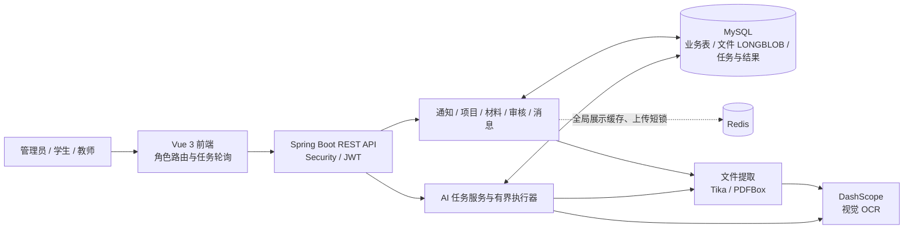
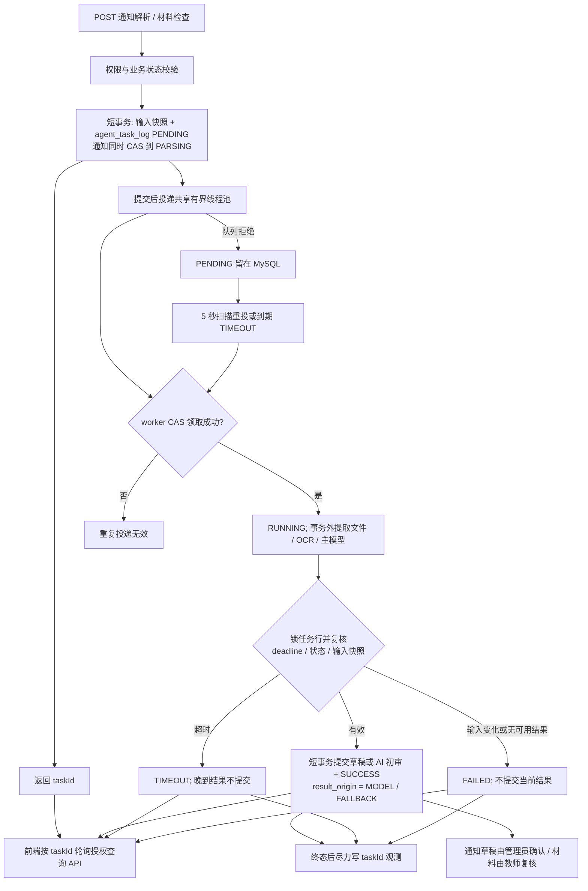
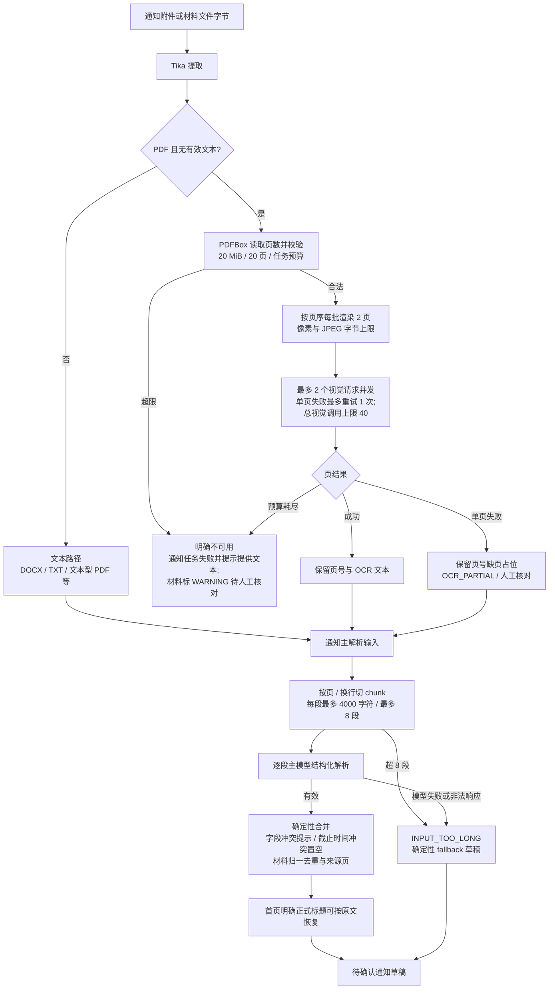

# 三张核心工程图（绘图底稿）

以下节点以当前单体代码、配置和测试为依据。线条表示真实调用或数据依赖；其中任务恢复只按单实例语义描述。

## 1. 系统整体架构

- MySQL 是权限、业务状态和 AI 任务的事实来源；Redis 不负责 AI 任务排队或结果正确性。
- 通知解析结果进待确认草稿；材料 AI 初审与教师审核分开记录。文件当前存于 MySQL，没有对象存储服务。
- Compose 部署把构建后的 Vue 静态文件放进 Spring Boot 镜像；没有单独的前端运行容器。

## 2. AI 异步任务链路

- 通知默认 300 秒、材料默认 600 秒，从接受时计入排队；`PENDING` 可扫描恢复，进程重启留下的 `RUNNING` 收为失败或超时，需有权用户显式发起新尝试。
- `SUCCESS/MODEL` 表示主模型结果被提交，不能单独证明 PDF OCR 全页覆盖；观测中的页数与诊断码是另一维度。
- 模型调用失败时 `AiService` 返回确定性的待人工处理结果，任务可为 `SUCCESS/FALLBACK`。输入变化、总 deadline 到期或通知完全不可提取等路径没有可用结果，落 `FAILED/TIMEOUT`。终态结果写入与业务写入同事务，观测写入在其后尽力执行。

## 3. PDF OCR 与长文档处理

- 第 3 图的 `chunk` 路径对应**通知结构化解析**；材料初审复用 Tika/OCR 提取与缺页提示，但使用自己的项目材料上下文和主模型检查，不走通知分段合并。
- `partial` 仅指在允许处理的页数内有单页失败且其他页可用；超页、超字节、预算耗尽或零可用页不能被画成“完整成功”。限时 future 不能保证底层 HTTP 立即终止，最终结果仍受第 2 图的任务终态保护。
- “deterministic fallback”是模型失败或通知过长时生成的可人工处理草稿；首页标题恢复是有原文证据时的确定性修正，两者含义不同。

## 绘图证据

[任务与扫描器](../../backend/src/main/java/com/eliza/aicompetition/service/NoticeAiTaskDispatcher.java) · [通知任务](../../backend/src/main/java/com/eliza/aicompetition/service/NoticeService.java) · [材料任务](../../backend/src/main/java/com/eliza/aicompetition/service/AgentService.java) · [提取路由](../../backend/src/main/java/com/eliza/aicompetition/common/FileTextExtractor.java) · [OCR 实现](../../backend/src/main/java/com/eliza/aicompetition/common/PdfOcrExtractor.java) · [分段与合并](../../backend/src/main/java/com/eliza/aicompetition/service/AiService.java) · [配置](../../backend/src/main/resources/application.properties)
